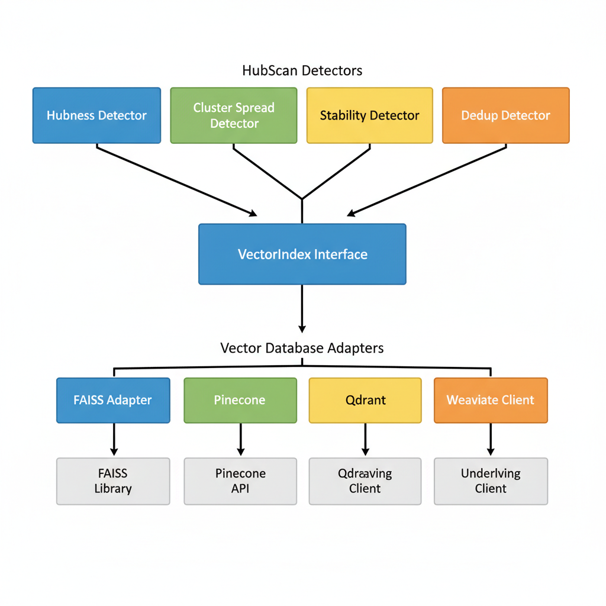

# HubScan: Adversarial Hubness Detection for RAG Systems

[](LICENSE)
[](https://www.python.org/downloads/)

HubScan is an open-source security scanner that audits vector indices and embeddings to detect **adversarial hubs** in Retrieval-Augmented Generation (RAG) and vector search systems. It supports multiple vector databases (FAISS, Pinecone, Qdrant, Weaviate) and identifies malicious document embeddings that manipulate retrieval results by appearing in top-k results for an unusually large fraction of diverse queries.

## Table of Contents

- [Overview](#overview)
- [What is Adversarial Hubness?](#what-is-adversarial-hubness)
- [Features](#features)
- [Installation](#installation)
- [Quick Start](#quick-start)
- [Usage](#usage)
- [Configuration](#configuration)
- [Understanding Results](#understanding-results)
- [Performance Tuning](#performance-tuning)
- [Security Considerations](#security-considerations)
- [Development](#development)
- [Contributing](#contributing)
- [License](#license)

## Overview

Adversarial hubs are a security vulnerability in vector search systems where malicious actors create document embeddings that appear in top-k retrieval results for many semantically diverse queries. This can be exploited to:

- Inject malicious or unwanted content into RAG responses
- Manipulate search rankings and results
- Bypass content filters and moderation
- Degrade system performance and user experience

HubScan provides comprehensive detection capabilities using multiple statistical and machine learning techniques to identify these adversarial patterns.

## What is Adversarial Hubness?

In vector search systems, **hubness** is a natural phenomenon where some documents appear more frequently in nearest-neighbor results. However, **adversarial hubs** are artificially created vectors that exhibit:

1. **Unusually High Hub Rate**: Appear in top-k results for 20-50%+ of queries (vs. typical 2-5%)
2. **Cross-Cluster Spread**: Retrieved by queries from many diverse semantic clusters
3. **Stability**: Consistently appear under query perturbations
4. **Statistical Anomaly**: Hub rates that are 5-10+ standard deviations above the median

HubScan uses robust statistical methods (median/MAD-based z-scores) to identify these anomalies while being resistant to false positives from legitimate popular content. The detection system employs rank-aware and distance-based scoring to provide more accurate identification of adversarial hubs by weighting documents that appear at higher ranks and with higher similarity scores more heavily. Detection metrics vary significantly between different retrieval techniques (vector similarity, hybrid search, lexical matching) and reranking methods, so HubScan offers a flexible, puzzle-like approach where you can mix and match retrieval methods, reranking methods, and detectors to uncover adversarial patterns that might be missed by any single technique.

### Detection Metrics


*HubScan identifies adversarial hubs through four key detection metrics: unusually high hub rate, cross-cluster spread, stability under perturbations, and statistical anomaly detection using robust z-scores.*

### Visualizing Adversarial Hubness


*An adversarial hub (red) appears in top-k results for queries from multiple diverse semantic clusters, making it statistically anomalous compared to normal documents (blue).*

## Features

### Core Capabilities

- **Multiple Detection Strategies**:
  - **Hubness Detection**: Reverse-kNN frequency analysis with robust z-scores
    - Rank-aware scoring: Higher weights for documents appearing at top ranks (rank 1 > rank k)
    - Distance-based scoring: Incorporates similarity/distance scores for more accurate detection
    - **Works with**: All retrieval methods (vector, hybrid, lexical) with optional reranking
  - **Cluster Spread Analysis**: Entropy-based detection of multi-cluster proximity
    - Measures how many diverse semantic query clusters retrieve each document
    - **Works with**: Vector, hybrid (with optional reranking) - skipped for lexical (requires semantic clustering)
  - **Stability Testing**: Consistency analysis under query perturbations
    - Tests retrieval consistency by perturbing query embeddings
    - **Works with**: Vector, hybrid (with optional reranking) - skipped for lexical (requires query embeddings)
  - **Deduplication**: Boilerplate and duplicate detection
    - **Works with**: All ranking methods (doesn't depend on retrieval method)

- **Multiple Retrieval Methods**:
  - **Vector Search (KNN)**: Classic vector similarity search (default)
    - Uses all detection strategies
    - Best for: Detecting vector-optimized adversarial hubs
  - **Hybrid Search**: Combines vector similarity with lexical/keyword matching (BM25)
    - Uses all detection strategies (cluster spread and stability use hybrid search)
    - Best for: Detecting both vector-optimized and lexical-optimized hubs
    - May benefit from relaxed thresholds (see method-specific configuration)
  - **Lexical Search**: Pure keyword-based search using BM25/TF-IDF
    - Uses only hubness and dedup detectors (cluster spread and stability automatically skipped)
    - Best for: Detecting keyword-optimized adversarial hubs
  
- **Reranking Methods (Post-Processing)**:
  - Optional reranking step that can be applied to any retrieval method
  - Retrieves more candidates (rerank_top_n), then reranks to return top k
  - Can be enabled for vector, hybrid, or lexical retrieval
  - Supports custom reranking algorithms via plugin system
  - Works seamlessly with all detectors (hubness, cluster spread, stability, dedup)
  - Best for: High-precision detection with semantic reranking or custom scoring
  - Built-in: `default` reranking (simple top-k selection)
  - Custom reranking methods can be registered via plugin system

- **Comparison and Configuration**:
  - Supports comparison across retrieval methods to evaluate detection effectiveness
  - Method-specific thresholds available for fine-tuning per retrieval method
  - **Pluggable Architecture**: Extend HubScan with custom retrieval methods, reranking methods, and detectors (see [Plugin System](docs/PLUGINS.md))

- **Comprehensive Detection Metrics**:
  - **Detection Performance Metrics**: AUC-ROC, AUC-PR, confusion matrix, per-class metrics
  - **Comparative Analysis**: Evaluate detection performance across different retrieval methods

- **Flexible Input Modes** (Plug-and-Play Architecture):
  - `embeddings_only`: Build vector index on-the-fly from embeddings (uses FAISS by default)
  - `faiss_index`: Use pre-built FAISS indices
  - `pinecone`: Connect to Pinecone vector database
  - `qdrant`: Connect to Qdrant vector database
  - `weaviate`: Connect to Weaviate vector database
  - `vector_db_export`: Import from vector database exports (planned)

- **Scalable Architecture**:
  - Designed for large corpora (1M+ vectors)
  - Batch processing and streaming support
  - Memory-efficient operations
  - Configurable performance vs. accuracy trade-offs

- **Rich Reporting**:
  - Machine-readable JSON reports
  - Human-friendly HTML visualizations
  - Detailed metrics and evidence
  - Privacy-safe mode for sensitive data

- **Developer-Friendly**:
  - Simple CLI interface
  - Python SDK for programmatic access
  - Comprehensive test suite
  - Well-documented API

### Multi-Ranking Detection Pipeline


*The complete pipeline shows how different retrieval methods (vector, hybrid, lexical) can optionally use reranking methods as post-processing, then feed into the detection system with multiple detectors (hubness, cluster spread, stability, dedup), score combination, and report generation.*

### Detection Performance Metrics

HubScan provides comprehensive metrics for evaluating detection performance:

| Metric | Description |
|--------|-------------|
| **AUC-ROC** | Area under ROC curve (TPR vs FPR) |
| **AUC-PR** | Area under Precision-Recall curve |
| **Confusion Matrix** | TP, FP, TN, FN counts |
| **Per-Class Metrics** | Precision, Recall, F1 for each class |

### Vector Database Abstraction Layer



*HubScan's plug-and-play architecture supports multiple vector databases through a unified VectorIndex interface. Detectors work seamlessly with FAISS, Pinecone, Qdrant, Weaviate, and other backends via adapter pattern.*

## Installation

### Prerequisites

- Python 3.11 or higher
- pip package manager

### Install from Source

```bash
# Clone the repository
git clone https://github.com/Habler-code/AdversarialHubness.git
cd AdversarialHubness

# Install in development mode
pip install -e .

# Or install dependencies directly
pip install -r requirements.txt
```

### Install with Optional Dependencies

HubScan supports optional dependencies for vector database adapters and GPU acceleration:

```bash
# Install with specific vector database support
pip install -e ".[pinecone]"      # Pinecone support
pip install -e ".[qdrant]"        # Qdrant support
pip install -e ".[weaviate]"      # Weaviate support
pip install -e ".[vector-dbs]"    # All vector database adapters

# Install with GPU support (includes faiss-gpu; you may want to uninstall faiss-cpu)
pip install -e ".[gpu]"
# Note: If using GPU, consider: pip uninstall faiss-cpu

# Install with all optional dependencies
pip install -e ".[all]"

# Combine multiple extras
pip install -e ".[pinecone,qdrant,gpu]"
```

### Dependencies

**Core dependencies** (installed by default):
- `numpy` - Numerical computations
- `faiss-cpu` - Vector similarity search (CPU version)
- `scikit-learn` - Clustering and ML utilities
- `pydantic` - Configuration validation
- `rich` - CLI formatting
- `scipy`, `pandas`, `tqdm`, `click`, `jinja2`, `pyyaml` - Supporting libraries

**Optional dependencies**:
- `pinecone-client>=3.0.0` - For Pinecone vector database support
- `qdrant-client>=1.7.0` - For Qdrant vector database support
- `weaviate-client>=4.0.0` - For Weaviate vector database support
- `faiss-gpu>=1.7.4` - GPU-accelerated vector search (alternative to faiss-cpu)

See `requirements.txt` and `pyproject.toml` for complete dependency lists.

## Quick Start

### 1. Generate Sample Data

```bash
python examples/generate_toy_data.py
```

This creates sample embeddings and metadata in `examples/` directory.

### 2. Run Your First Scan

```bash
hubscan scan --config examples/toy_config.yaml
```

### 3. View Results

- **JSON Report**: `examples/reports/report.json` - Full machine-readable details
- **HTML Report**: `examples/reports/report.html` - Visual dashboard

### 4. Try the Demo

See the complete adversarial hub detection demo:

```bash
python examples/adversarial_hub_demo.py
```

This demonstrates:
- Document generation and chunking
- Embedding creation
- Adversarial hub planting
- Detection and identification

## Usage

### Command-Line Interface

```bash
# Run a scan
hubscan scan --config config.yaml

# Use different retrieval methods
hubscan scan --config config.yaml --ranking-method hybrid --query-texts queries.json
hubscan scan --config config.yaml --ranking-method lexical --query-texts queries.json

# Compare retrieval methods
hubscan compare-ranking --config config.yaml --methods vector hybrid lexical

# Build an index
hubscan build-index --config config.yaml
```

### Python SDK

```python
from hubscan.sdk import scan, get_suspicious_documents, Verdict

# Simple scan
results = scan(
    embeddings_path="data/embeddings.npy",
    k=20,
    num_queries=10000
)

# Get high-risk documents
high_risk = get_suspicious_documents(results, verdict=Verdict.HIGH, top_k=10)
```

### Advanced Usage

```python
from hubscan import Config, Scanner

config = Config.from_yaml("config.yaml")
scanner = Scanner(config)
scanner.load_data()
results = scanner.scan()
```

For complete usage documentation, examples, and API reference, see:
- [Usage Guide](docs/USAGE.md) - Complete usage documentation
- [SDK Documentation](docs/SDK.md) - Python SDK reference

### Plugin System

HubScan supports a pluggable architecture that allows you to extend the system with custom ranking methods and detectors. Custom components integrate seamlessly with the existing pipeline and are automatically included in reports and scoring.

For complete documentation, code examples, and integration guides, see [Plugin System Documentation](docs/PLUGINS.md).

## Configuration

HubScan uses YAML configuration files to control all aspects of the scanning process. Configuration includes:

- **Input**: Data sources (embeddings, indices, vector databases)
- **Index**: FAISS index type and parameters
- **Scan**: Query sampling, retrieval methods, reranking methods, batch processing
- **Detectors**: Enable/configure detection algorithms
- **Scoring**: Weight detector outputs and set thresholds
- **Output**: Report generation and privacy settings

### Example Configuration

```yaml
input:
  mode: embeddings_only
  embeddings_path: data/embeddings.npy
  metric: cosine

scan:
  k: 20
  num_queries: 10000
  ranking:
    method: vector  # Retrieval method: vector, hybrid, or lexical
    rerank: true  # Enable reranking as post-processing
    rerank_method: default  # Reranking method: default or custom registered method
    rerank_top_n: 100  # Retrieve 100 candidates, rerank to top k

detectors:
  hubness:
    enabled: true
  cluster_spread:
    enabled: true
```

For complete configuration reference, see [Usage Guide](docs/USAGE.md) and example configurations in `examples/` and `benchmarks/configs/`.
```

## Understanding Results

HubScan generates comprehensive reports with risk scores, verdicts, and detailed metrics for each document. Reports are available in JSON (machine-readable) and HTML (visual dashboard) formats.

### Verdict Levels

- **HIGH**: Highly suspicious (adversarial hub likely) - Quarantine and investigate
- **MEDIUM**: Some suspicious characteristics - Review and monitor
- **LOW**: Appears normal - No action needed

### Key Metrics

HubScan evaluates documents using multiple metrics:

- **Hub Rate**: Weighted fraction of queries retrieving the document (rank and distance weighted)
- **Hub Z-Score**: Robust z-score indicating statistical anomaly
- **Cluster Spread**: Diversity of semantic clusters retrieving the document
- **Stability**: Consistency under query perturbations
- **Risk Score**: Combined weighted score from all detectors

Reports include detailed explanations, example queries, and evidence for each detected hub. For complete documentation on interpreting results, see [Usage Guide](docs/USAGE.md).

## Performance Tuning

### Fast Screening Scan

For quick scans on large corpora:

```yaml
index:
  type: flat  # Fastest for small-medium corpora

scan:
  num_queries: 1000  # Fewer queries
  k: 10  # Smaller k

detectors:
  hubness:
    enabled: true
  cluster_spread:
    enabled: false  # Disable expensive detectors
  stability:
    enabled: false
```

**Expected Runtime**: 1-5 minutes for 100K documents

### Deep Scan

For comprehensive analysis:

```yaml
index:
  type: hnsw  # or ivf_pq for very large corpora
  params:
    M: 32
    efSearch: 128

scan:
  num_queries: 10000  # More queries for better statistics
  k: 20

detectors:
  hubness:
    enabled: true
    validate_exact: true  # Validate with exact search
  cluster_spread:
    enabled: true
  stability:
    enabled: true
```

**Expected Runtime**: 10-60 minutes for 1M documents

## Security Considerations

### Privacy Mode

Enable privacy mode to redact sensitive information:

```yaml
output:
  privacy_mode: true  # Redacts text, paths, tenant IDs
  emit_embeddings: false  # Don't include raw embeddings
```

### Multi-Tenant Systems

- Ensure scan results are properly secured
- Use privacy mode when scanning shared indices
- Be careful with metadata that may leak tenant information

### Access Control

- Restrict access to scan results
- Use secure storage for reports
- Audit scan execution logs

## Development

### Setup Development Environment

```bash
git clone https://github.com/Habler-code/AdversarialHubness.git
cd AdversarialHubness

# Install with development dependencies
pip install -e ".[dev]"

# Or install with all optional dependencies for testing
pip install -e ".[dev,all]"
```

### Running Tests

```bash
# Run all tests
pytest tests/

# Run with coverage
pytest tests/ --cov=hubscan --cov-report=html

# Run specific test
pytest tests/test_hubness.py -v
```

See [TESTING.md](TESTING.md) for detailed testing guide.

### Code Quality

```bash
# Type checking
mypy hubscan/

# Linting
ruff check hubscan/

# Formatting
black hubscan/
```

### Project Structure

```
AdversarialHubness/
├── hubscan/              # Main package
│   ├── __init__.py
│   ├── cli.py           # CLI interface
│   ├── sdk.py           # SDK functions
│   ├── config/          # Configuration management
│   ├── core/            # Core functionality
│   │   ├── scanner.py  # Main orchestrator
│   │   ├── io/         # I/O operations
│   │   ├── sampling/   # Query sampling
│   │   ├── detectors/  # Detection algorithms
│   │   ├── scoring/    # Score combination
│   │   └── report/     # Report generation
│   └── utils/          # Utilities
├── tests/               # Test suite
├── examples/           # Examples and demos
├── docs/               # Documentation
├── pyproject.toml      # Project configuration
└── README.md
```

## Contributing

Contributions are welcome! Please see our contributing guidelines:

1. Fork the repository
2. Create a feature branch (`git checkout -b feature/amazing-feature`)
3. Make your changes
4. Add tests for new functionality
5. Ensure all tests pass (`pytest tests/`)
6. Commit your changes (`git commit -m 'Add amazing feature'`)
7. Push to the branch (`git push origin feature/amazing-feature`)
8. Open a Pull Request

### Development Guidelines

- Follow PEP 8 style guidelines
- Write comprehensive tests
- Update documentation
- Add type hints
- Write clear commit messages

## License

This project is licensed under the Apache License 2.0 - see the [LICENSE](LICENSE) file for details.

## References

- [FAISS Documentation](https://github.com/facebookresearch/faiss)
- [Adversarial Hubness in RAG Systems](https://ztingwei.com/publication/preprint_hubness/)
- [Vector Search Security Best Practices](https://github.com/cisco-ai-defense/vector-search-security)

## Support

For issues, questions, or contributions:

- **GitHub Issues**: [https://github.com/Habler-code/AdversarialHubness/issues](https://github.com/Habler-code/AdversarialHubness/issues)
- **Documentation**: See `docs/` directory for detailed guides
  - [Usage Guide](docs/USAGE.md) - Complete usage documentation
  - [SDK Documentation](docs/SDK.md) - Python SDK reference
  - [Plugin System](docs/PLUGINS.md) - Extending HubScan with custom components

## Acknowledgments

Developed with security and performance in mind for production RAG systems.
