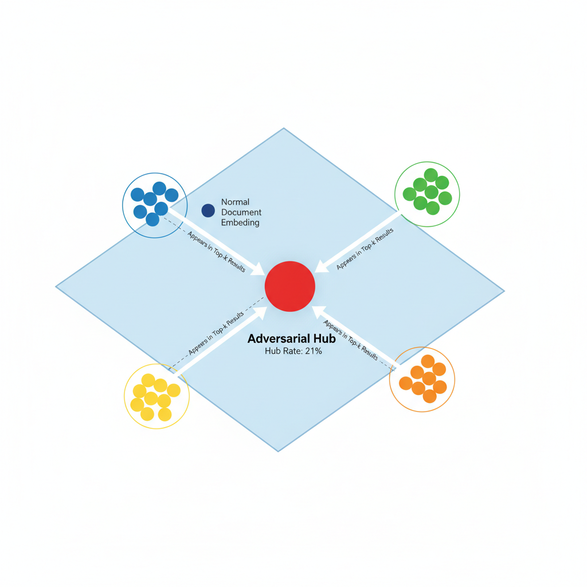
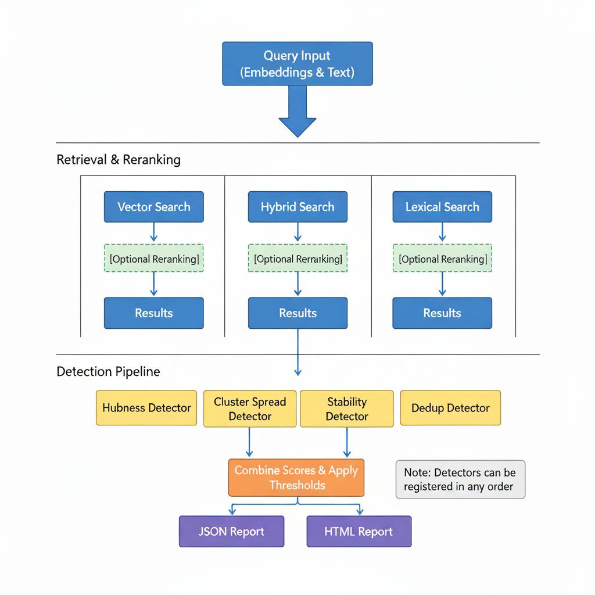

# HubScan: Adversarial Hubness Detection for RAG Systems

[](LICENSE)
[](https://www.python.org/downloads/)

HubScan is an open-source security scanner that audits vector indices and embeddings to detect **adversarial hubs** in Retrieval-Augmented Generation (RAG) and vector search systems. It supports multiple vector databases (FAISS, Pinecone, Qdrant, Weaviate) and provides comprehensive detection capabilities including **multimodal hub detection** (for image-text and cross-modal systems), **concept-aware detection** (for category-specific hubs), and **flexible retrieval methods** (vector similarity, hybrid search, lexical matching) with support for **custom retrieval and reranking algorithms** via a plugin system. HubScan identifies potentially malicious document embeddings that manipulate retrieval results by appearing in top-k results for an unusually large fraction of diverse queries.

## Table of Contents

- [Overview](#overview)
- [What is Adversarial Hubness?](#what-is-adversarial-hubness)
- [Features](#features)
- [Installation](#installation)
- [Quick Start](#quick-start)
- [Usage](#usage)
- [Benchmarks](#benchmarks)
- [Documentation](#documentation)
- [Contributing](#contributing)
- [License](#license)

## Overview

Adversarial hubs are a security vulnerability in vector search systems where malicious actors create document embeddings that appear in top-k retrieval results for many semantically diverse queries. This can be exploited to:

- Inject malicious or unwanted content into RAG responses
- Manipulate search rankings and results
- Bypass content filters and moderation
- Degrade system performance and user experience

HubScan provides comprehensive detection capabilities using multiple statistical and machine learning techniques to identify these adversarial patterns.

## What is Adversarial Hubness?

In vector search systems, **hubness** is a natural phenomenon where some documents appear more frequently in nearest-neighbor results. However, **adversarial hubs** are artificially created vectors that exhibit:

1. **Unusually High Hub Rate**: Appear in top-k results for 20-50%+ of queries (vs. typical 2-5%)
2. **Cross-Cluster Spread**: Retrieved by queries from many diverse semantic clusters
3. **Stability**: Consistently appear under query perturbations
4. **Statistical Anomaly**: Hub rates that are 5-10+ standard deviations above the median

HubScan uses robust statistical methods (median/MAD-based z-scores) to identify these anomalies while being resistant to false positives from legitimate popular content.



### Three Detection Modes

HubScan offers three levels of detection sophistication:


- **Global Detection**: Identifies hubs across all queries
- **Concept-Aware Detection**: Detects hubs within specific semantic categories
- **Modality-Aware Detection**: Identifies cross-modal hubs in multimodal systems

See [Concept and Modality Guide](docs/CONCEPTS_AND_MODALITIES.md) for detailed information.

## Features

### Core Capabilities

- **Multiple Detection Strategies**: Hubness detection, cluster spread analysis, stability testing, and deduplication
- **Advanced Detection Modes**: Concept-aware and modality-aware detection for specialized use cases
- **Multiple Retrieval Methods**: Vector search, hybrid search (vector + lexical), and pure lexical search
- **Client-Side Hybrid Search**: Works with any vector database by combining dense search with local BM25/TF-IDF
- **Reranking Support**: Optional post-processing reranking for improved precision
- **Multi-Index Late Fusion**: Gold standard architecture for secure multimodal RAG systems
- **Vector Database Support**: FAISS, Pinecone, Qdrant, Weaviate with unified interface
- **Comprehensive Reporting**: JSON and HTML reports with detailed metrics and evidence
- **Plugin System**: Extensible architecture for custom retrieval methods, reranking, and detectors

### Hybrid Search

HubScan supports **true hybrid search** across all vector database adapters through client-side fusion:

- **Client Fusion Mode**: Performs dense (vector) search in your DB, then computes BM25/TF-IDF scores locally from document texts, and fuses results
- **Native Mode**: Uses database-native hybrid capabilities (Weaviate BM25, Pinecone sparse vectors)
- **Configurable Alpha**: Control the balance between semantic (dense) and lexical (sparse) search

```yaml
# Example hybrid search configuration
scan:
  ranking:
    method: hybrid
    hybrid_alpha: 0.7  # 70% vector, 30% lexical
    hybrid:
      backend: client_fusion  # or "native_sparse" for DB-native
      lexical_backend: bm25   # or "tfidf"
      text_field: text        # metadata field with document text
```

This enables hybrid search on **any vector database**, even those without native sparse vector support, by requiring document texts in your metadata.

### Detection Pipeline



HubScan supports flexible retrieval and reranking combinations, feeding into multiple detectors that combine scores and generate comprehensive reports.

For complete feature documentation, see [Usage Guide](docs/USAGE.md).

## Installation

### Prerequisites

- Python 3.11 or higher
- pip package manager

### Install from Source

```bash
# Clone the repository
git clone https://github.com/Habler-code/AdversarialHubness.git
cd AdversarialHubness

# Install in development mode
pip install -e .

# Or install dependencies directly
pip install -r requirements.txt

# For development/test tooling
pip install -r requirements-dev.txt
```

### Install with Optional Dependencies

```bash
# Install with specific vector database support
pip install -e ".[pinecone]"      # Pinecone support
pip install -e ".[qdrant]"        # Qdrant support
pip install -e ".[weaviate]"      # Weaviate support
pip install -e ".[vector-dbs]"    # All vector database adapters

# Install with GPU support
pip install -e ".[gpu]"

# Install with all optional dependencies
pip install -e ".[all]"
```

See [Installation Guide](docs/USAGE.md#installation) for complete dependency information.

## Quick Start

### 1. Generate Sample Data

```bash
python examples/scripts/generate_toy_data.py
```

### 2. Run Your First Scan

```bash
hubscan scan --config examples/configs/toy_config.yaml
```

### 3. View Results

- **JSON Report**: `examples/reports/report.json` - Full machine-readable details
- **HTML Report**: `examples/reports/report.html` - Visual dashboard

### 4. Try Advanced Detection

```bash
# Concept-aware detection
hubscan scan --config config.yaml --concept-aware --concept-field category

# Modality-aware detection
hubscan scan --config config.yaml --modality-aware --modality-field type

# Multi-index with late fusion
hubscan scan --config config.yaml \
    --multi-index \
    --text-index data/text_index.index \
    --image-index data/image_index.index \
    --text-embeddings data/text_embeddings.npy \
    --image-embeddings data/image_embeddings.npy \
    --late-fusion
```

## Usage

### Command-Line Interface

```bash
# Run a scan
hubscan scan --config config.yaml

# Use different retrieval methods
hubscan scan --config config.yaml --ranking-method hybrid
hubscan scan --config config.yaml --ranking-method lexical

# Extract embeddings from vector database
hubscan extract-embeddings --config config.yaml --output embeddings.npy

# Compare retrieval methods
hubscan compare-ranking --config config.yaml --methods vector hybrid lexical

# Build an index
hubscan build-index --config config.yaml
```

### Python SDK

```python
from hubscan import scan, get_suspicious_documents, Verdict

# Simple scan with vector search
results = scan(
    embeddings_path="data/embeddings.npy",
    metadata_path="data/metadata.json",
    k=20,
    num_queries=10000
)

# Get high-risk documents
high_risk = get_suspicious_documents(results, verdict=Verdict.HIGH, top_k=10)

# Hybrid search (dense + lexical)
results = scan(
    embeddings_path="data/embeddings.npy",
    metadata_path="data/metadata.json",
    ranking_method="hybrid",
    hybrid_alpha=0.7,  # 70% vector, 30% lexical
    query_texts_path="data/query_texts.json",
    k=20,
    num_queries=10000
)

# Concept-aware detection
results = scan(
    embeddings_path="data/embeddings.npy",
    metadata_path="data/metadata.json",
    concept_aware=True,
    concept_field="category",
    k=20,
    num_queries=10000
)
```

For complete usage documentation, see:
- [Usage Guide](docs/USAGE.md) - Complete CLI and configuration documentation
- [SDK Documentation](docs/SDK.md) - Python SDK reference
- [Concept and Modality Guide](docs/CONCEPTS_AND_MODALITIES.md) - Advanced detection modes
- [Plugin System](docs/PLUGINS.md) - Extending HubScan with custom components

## Benchmarks

HubScan includes comprehensive benchmarks with real datasets to evaluate detection performance:

| Dataset | Type | Detection Mode | Precision | Recall | F1 |
|---------|------|---------------|-----------|--------|-----|
| Wikipedia | Text with Categories | Concept-Aware | 96% | 100% | 0.98 |
| Multimodal | Image + Text | Modality-Aware | 100% | 100% | 1.00 |

### Running Benchmarks

```bash
cd benchmarks/scripts

# Wikipedia benchmark (text-only with concepts)
python run_benchmark.py \
    --dataset ../data/wikipedia/ \
    --config ../configs/concept_modality.yaml

# Multimodal benchmark (separate embedding spaces)
python run_benchmark.py \
    --dataset ../data/multimodal/ \
    --config ../configs/multimodal.yaml
```

See [benchmarks documentation](benchmarks/README.md) for complete methodology, dataset generation, and detailed results.

## Documentation

Complete documentation is available in the `docs/` directory:

- **[Usage Guide](docs/USAGE.md)** - Complete CLI and configuration documentation
- **[SDK Documentation](docs/SDK.md)** - Python SDK reference and examples
- **[Concept and Modality Guide](docs/CONCEPTS_AND_MODALITIES.md)** - Advanced detection modes and architecture
- **[Plugin System](docs/PLUGINS.md)** - Extending HubScan with custom components
- **[Benchmarks](benchmarks/README.md)** - Evaluation methodology and results

## Contributing

Contributions are welcome! Please see our contributing guidelines:

1. Fork the repository
2. Create a feature branch (`git checkout -b feature/amazing-feature`)
3. Make your changes
4. Add tests for new functionality
5. Ensure all tests pass (`pytest tests/`)
6. Commit your changes (`git commit -m 'Add amazing feature'`)
7. Push to the branch (`git push origin feature/amazing-feature`)
8. Open a Pull Request

### Development Guidelines

- Follow PEP 8 style guidelines
- Write comprehensive tests
- Update documentation
- Add type hints
- Write clear commit messages

See [Development Guide](docs/USAGE.md#development) for setup instructions and testing details.

## License

This project is licensed under the Apache License 2.0 - see the [LICENSE](LICENSE) file for details.

## References

- [FAISS Documentation](https://github.com/facebookresearch/faiss)
- [Adversarial Hubness in RAG Systems](https://ztingwei.com/publication/preprint_hubness/)
- [Vector Search Security Best Practices](https://github.com/cisco-ai-defense/vector-search-security)

## Support

For issues, questions, or contributions:

- **GitHub Issues**: [https://github.com/Habler-code/AdversarialHubness/issues](https://github.com/Habler-code/AdversarialHubness/issues)
- **Documentation**: See `docs/` directory for detailed guides

## Acknowledgments

Developed with security and performance in mind for production RAG systems.
