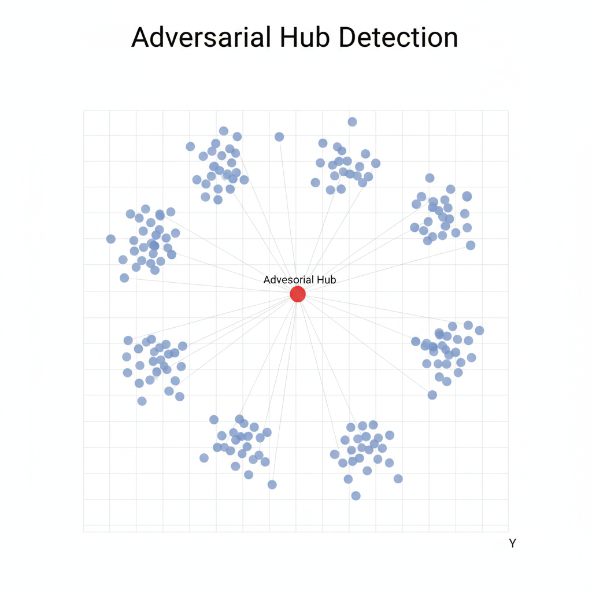
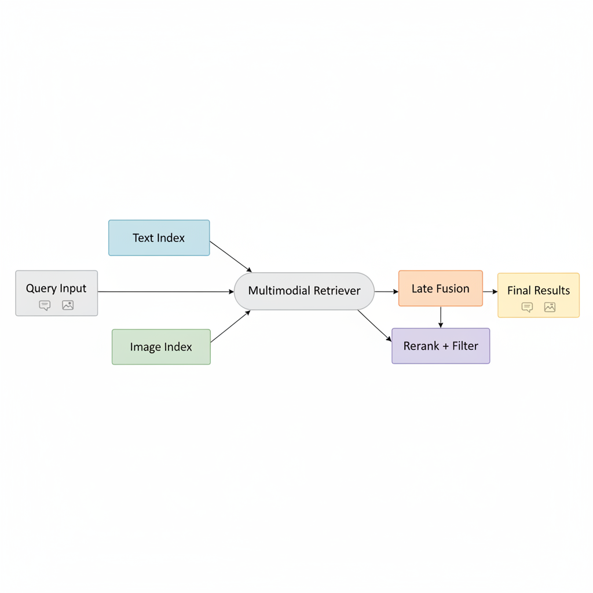

# HubScan: Adversarial Hubness Detection for RAG Systems

[](LICENSE)
[](https://www.python.org/downloads/)

HubScan detects adversarial hubs in vector indices and RAG systems—malicious embeddings that manipulate retrieval by appearing in top-k results for an unusually large fraction of queries.



## Quick Start

```bash
# Install
pip install -e .

# Basic scan
hubscan scan --config config.yaml

# With concept-aware detection
hubscan scan --config config.yaml --concept-aware --concept-field category
```

**Python SDK:**
```python
from hubscan import scan

results = scan(
    embeddings_path="data/embeddings.npy",
    metadata_path="data/metadata.json",
    k=20,
    num_queries=10000
)
```

## Key Features

### Three Detection Modes


| Mode | Purpose | Use Case |
|------|--------|----------|
| **Global** | Detects hubs across all queries | Default, always recommended |
| **Concept-Aware** | Detects hubs within specific topics | Data with semantic categories |
| **Modality-Aware** | Detects cross-modal hubs | Multimodal systems (text + image) |

### Production Architecture



Supports separate embedding spaces with parallel retrieval and late fusion for secure multimodal RAG.

## What is Adversarial Hubness?

In vector search, hubness occurs when some documents naturally appear in many nearest-neighbor results. **Adversarial hubs** are artificially crafted embeddings that exploit this to:

- Inject malicious content into RAG responses
- Manipulate search rankings
- Bypass content moderation
- Degrade system quality

### Detection Metrics

| Metric | Description | Threshold |
|--------|-------------|-----------|
| Hub Rate | Fraction of queries retrieving the document | >5% suspicious |
| Hub Z-Score | Statistical deviation from median | >5.0 HIGH risk |
| Concept Hub Z | Per-topic hubness z-score | >4.0 concept-specific hub |

## Installation

```bash
git clone https://github.com/cisco-ai-defense/hubscan.git
cd hubscan
pip install -e .

# With vector database support
pip install -e ".[pinecone,qdrant,weaviate]"
```

**Requirements:** Python 3.11+

## Usage

### Basic Detection

```bash
hubscan scan --config config.yaml
```

```python
from hubscan import scan

results = scan(
    embeddings_path="data/embeddings.npy",
    metadata_path="data/metadata.json",
    k=20,
    num_queries=10000
)
```

### Concept-Aware Detection

Detects hubs that dominate within specific semantic categories.

```bash
hubscan scan --config config.yaml \
    --concept-aware \
    --concept-field category
```

```python
results = scan(
    embeddings_path="data/embeddings.npy",
    metadata_path="data/metadata.json",
    concept_aware=True,
    concept_field="category"
)
```

### Modality-Aware Detection

Detects hubs exploiting cross-modal retrieval patterns.

```bash
hubscan scan --config config.yaml \
    --modality-aware \
    --modality-field type
```

```python
results = scan(
    embeddings_path="data/embeddings.npy",
    metadata_path="data/metadata.json",
    modality_aware=True,
    modality_field="modality"
)
```

### Multi-Index Late Fusion

For multimodal systems with separate indexes:

```bash
hubscan scan --config config.yaml \
    --multi-index \
    --text-index data/text_index.index \
    --image-index data/image_index.index \
    --late-fusion \
    --fusion-method rrf
```

## Benchmark Results

| Dataset | Type | Precision | Recall | F1 |
|---------|------|-----------|--------|-----|
| Wikipedia | Text with Categories | 96% | 100% | 0.98 |
| Multimodal | Image + Text | 100% | 100% | 1.00 |

See [benchmarks documentation](benchmarks/README.md) for detailed methodology.

## Customizing for Your Data

### Field Name Mapping

HubScan adapts to your metadata field names:

| Your Field | HubScan Parameter | Example |
|------------|-------------------|---------|
| `category`, `topic`, `subject` | `concept_field` | "news", "sports", "tech" |
| `type`, `media_type`, `format` | `modality_field` | "text", "image", "video" |

```bash
hubscan scan -c config.yaml \
    --concept-aware --concept-field topic \
    --modality-aware --modality-field media_type
```

### Auto-Clustering

No concept metadata? HubScan automatically clusters queries:

```yaml
detectors:
  concept_aware:
    enabled: true
    mode: query_clustering
    num_concepts: 10
```

## Supported Vector Databases

| Database | Status |
|----------|--------|
| FAISS | Full support |
| Pinecone | Full support |
| Qdrant | Full support |
| Weaviate | Full support |
| Multi-Index | Gold standard multimodal |

### Extracting Embeddings

Extract embeddings from external vector databases:

```bash
hubscan extract-embeddings \
    --config config.yaml \
    --output embeddings.npy
```

```python
from hubscan import Config, Scanner

scanner = Scanner(Config.from_yaml("config.yaml"))
scanner.load_data()
embeddings, ids = scanner.extract_embeddings(output_path="embeddings.npy")
```

## Configuration

Basic configuration:

```yaml
input:
  embeddings_path: data/embeddings.npy
  metadata_path: data/metadata.json

scan:
  k: 20
  num_queries: 10000

detectors:
  concept_aware:
    enabled: true
    metadata_field: category
  
  modality_aware:
    enabled: true
    doc_modality_field: modality

thresholds:
  hub_z: 5.0
  percentile: 0.015
```

See [Configuration Guide](docs/USAGE.md#configuration) for complete reference.

## Documentation

- **[Usage Guide](docs/USAGE.md)** - Complete CLI and configuration documentation
- **[SDK Reference](docs/SDK.md)** - Python SDK API reference
- **[Concept & Modality Guide](docs/CONCEPTS_AND_MODALITIES.md)** - Advanced detection modes
- **[Plugin System](docs/PLUGINS.md)** - Custom detectors and ranking methods

## Contributing

1. Fork the repository
2. Create a feature branch (`git checkout -b feature/amazing-feature`)
3. Add tests for new functionality
4. Ensure tests pass (`pytest tests/`)
5. Submit a Pull Request

## License

Apache License 2.0 - see [LICENSE](LICENSE)

## Support

- **Issues:** [GitHub Issues](https://github.com/cisco-ai-defense/hubscan/issues)
- **Documentation:** See `docs/` directory
