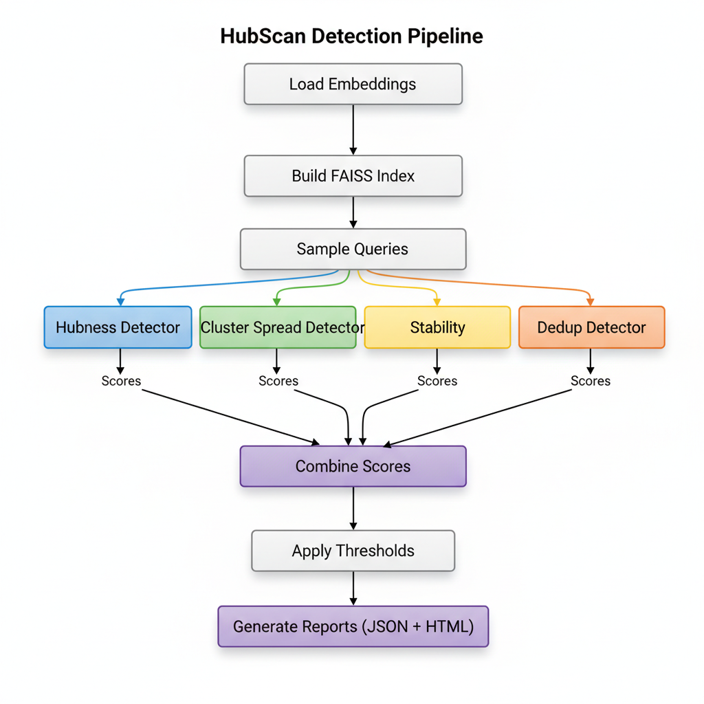
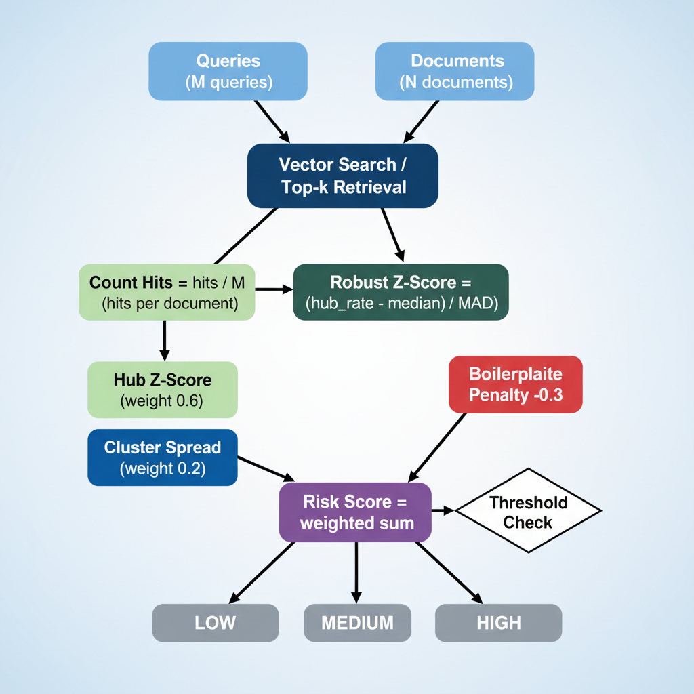
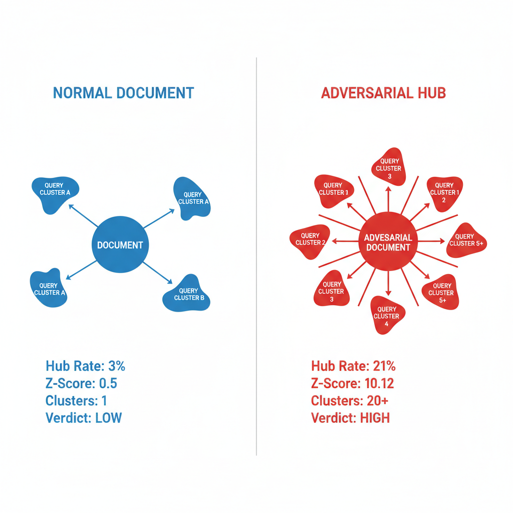

# HubScan: Adversarial Hubness Detection for RAG Systems

[](LICENSE)
[](https://www.python.org/downloads/)

HubScan is an open-source security scanner that audits vector indices and embeddings to detect **adversarial hubs** in Retrieval-Augmented Generation (RAG) and vector search systems. It supports multiple vector databases (FAISS, Pinecone, Qdrant, Weaviate) and identifies malicious document embeddings that manipulate retrieval results by appearing in top-k results for an unusually large fraction of diverse queries.

## Table of Contents

- [Overview](#overview)
- [What is Adversarial Hubness?](#what-is-adversarial-hubness)
- [Features](#features)
- [Installation](#installation)
- [Quick Start](#quick-start)
- [Usage](#usage)
- [Configuration](#configuration)
- [Understanding Results](#understanding-results)
- [Performance Tuning](#performance-tuning)
- [Security Considerations](#security-considerations)
- [Development](#development)
- [Contributing](#contributing)
- [License](#license)

## Overview

Adversarial hubs are a security vulnerability in vector search systems where malicious actors create document embeddings that appear in top-k retrieval results for many semantically diverse queries. This can be exploited to:

- Inject malicious or unwanted content into RAG responses
- Manipulate search rankings and results
- Bypass content filters and moderation
- Degrade system performance and user experience

HubScan provides comprehensive detection capabilities using multiple statistical and machine learning techniques to identify these adversarial patterns.

## What is Adversarial Hubness?

In vector search systems, **hubness** is a natural phenomenon where some documents appear more frequently in nearest-neighbor results. However, **adversarial hubs** are artificially created vectors that exhibit:

1. **Unusually High Hub Rate**: Appear in top-k results for 20-50%+ of queries (vs. typical 2-5%)
2. **Cross-Cluster Spread**: Retrieved by queries from many diverse semantic clusters
3. **Stability**: Consistently appear under query perturbations
4. **Statistical Anomaly**: Hub rates that are 5-10+ standard deviations above the median

HubScan uses robust statistical methods (median/MAD-based z-scores) to identify these anomalies while being resistant to false positives from legitimate popular content.

### Detection Metrics


*HubScan identifies adversarial hubs through four key detection metrics: unusually high hub rate, cross-cluster spread, stability under perturbations, and statistical anomaly detection using robust z-scores.*

### Visualizing Adversarial Hubness


*An adversarial hub (red) appears in top-k results for queries from multiple diverse semantic clusters, making it statistically anomalous compared to normal documents (blue).*

## Features

### Core Capabilities

- **Multiple Detection Strategies**:
  - **Hubness Detection**: Reverse-kNN frequency analysis with robust z-scores
  - **Cluster Spread Analysis**: Entropy-based detection of multi-cluster proximity
  - **Stability Testing**: Consistency analysis under query perturbations
  - **Deduplication**: Boilerplate and duplicate detection

- **Flexible Input Modes** (Plug-and-Play Architecture):
  - `embeddings_only`: Build vector index on-the-fly from embeddings (uses FAISS by default)
  - `faiss_index`: Use pre-built FAISS indices
  - `pinecone`: Connect to Pinecone vector database
  - `qdrant`: Connect to Qdrant vector database
  - `weaviate`: Connect to Weaviate vector database
  - `vector_db_export`: Import from vector database exports (planned)

- **Scalable Architecture**:
  - Designed for large corpora (1M+ vectors)
  - Batch processing and streaming support
  - Memory-efficient operations
  - Configurable performance vs. accuracy trade-offs

- **Rich Reporting**:
  - Machine-readable JSON reports
  - Human-friendly HTML visualizations
  - Detailed metrics and evidence
  - Privacy-safe mode for sensitive data

- **Developer-Friendly**:
  - Simple CLI interface
  - Python SDK for programmatic access
  - Comprehensive test suite
  - Well-documented API

### Detection Pipeline Architecture



*The HubScan detection pipeline processes embeddings through multiple parallel detectors, combines scores, applies thresholds, and generates comprehensive reports.*

### Vector Database Abstraction Layer


*HubScan's plug-and-play architecture supports multiple vector databases through a unified VectorIndex interface. Detectors work seamlessly with FAISS, Pinecone, Qdrant, Weaviate, and other backends via adapter pattern.*

## Installation

### Prerequisites

- Python 3.11 or higher
- pip package manager

### Install from Source

```bash
# Clone the repository
git clone https://github.com/Habler-code/AdversarialHubness.git
cd AdversarialHubness

# Install in development mode
pip install -e .

# Or install dependencies directly
pip install -r requirements.txt
```

### Dependencies

Core dependencies:
- `numpy` - Numerical computations
- `faiss-cpu` - Vector similarity search (or `faiss-gpu` for GPU support)
- `scikit-learn` - Clustering and ML utilities
- `pydantic` - Configuration validation
- `rich` - CLI formatting (optional)

See `requirements.txt` for complete list.

## Quick Start

### 1. Generate Sample Data

```bash
python examples/generate_toy_data.py
```

This creates sample embeddings and metadata in `examples/` directory.

### 2. Run Your First Scan

```bash
hubscan scan --config examples/toy_config.yaml
```

### 3. View Results

- **JSON Report**: `examples/reports/report.json` - Full machine-readable details
- **HTML Report**: `examples/reports/report.html` - Visual dashboard

### 4. Try the Demo

See the complete adversarial hub detection demo:

```bash
python examples/adversarial_hub_demo.py
```

This demonstrates:
- Document generation and chunking
- Embedding creation
- Adversarial hub planting
- Detection and identification

## Usage

### Command-Line Interface

#### Run a Scan

```bash
hubscan scan --config config.yaml
hubscan scan --config config.yaml --output custom_reports/
hubscan scan --config config.yaml --summary-only
```

#### Build an Index

```bash
hubscan build-index --config config.yaml
```

#### Explain a Document

```bash
hubscan explain --doc-id 42 --report reports/report.json
```

### Python SDK

#### Simple Scan

```python
from hubscan.sdk import scan, get_suspicious_documents, Verdict

# Run scan
results = scan(
    embeddings_path="data/embeddings.npy",
    metadata_path="data/metadata.json",
    k=20,
    num_queries=10000
)

# Get high-risk documents
high_risk = get_suspicious_documents(results, verdict=Verdict.HIGH, top_k=10)

for doc in high_risk:
    print(f"Doc {doc['doc_index']}: Risk={doc['risk_score']:.4f}")
```

#### Quick In-Memory Scan

```python
import numpy as np
from hubscan.sdk import quick_scan

embeddings = np.random.randn(1000, 128).astype(np.float32)
results = quick_scan(embeddings, k=10, num_queries=100)
```

#### Advanced Usage

```python
from hubscan import Config, Scanner

# Load and customize configuration
config = Config.from_yaml("config.yaml")
config.scan.k = 30
config.detectors.stability.enabled = True

# Run scan
scanner = Scanner(config)
scanner.load_data()
results = scanner.scan()
```

See [docs/USAGE.md](docs/USAGE.md) and [docs/SDK.md](docs/SDK.md) for detailed documentation.

## Configuration

HubScan uses YAML configuration files. See `examples/toy_config.yaml` for a complete example.

### Key Configuration Sections

#### Input Configuration

```yaml
input:
  mode: embeddings_only  # or "faiss_index" or "vector_db_export"
  embeddings_path: path/to/embeddings.npy
  metadata_path: path/to/metadata.json  # Optional
  metric: cosine  # or "ip" (inner product) or "l2"
```

#### Index Configuration

```yaml
index:
  type: flat  # or "hnsw" or "ivf_pq"
  params:
    M: 32  # HNSW: number of connections
    efSearch: 128  # HNSW: search width
    nlist: 4096  # IVF-PQ: number of clusters
    nprobe: 16  # IVF-PQ: search clusters
  save_path: path/to/index.index  # Optional
```

#### Scan Configuration

```yaml
scan:
  k: 20  # Number of nearest neighbors
  num_queries: 10000  # Total queries to sample
  query_sampling: mixed  # Strategy: "real_queries", "random_docs_as_queries", 
                         #          "cluster_centroids", "mixed"
  batch_size: 2048  # Batch size for processing
  seed: 42  # Random seed for reproducibility
```

#### Detector Configuration

```yaml
detectors:
  hubness:
    enabled: true
    validate_exact: false  # Validate with exact search (expensive)
  
  cluster_spread:
    enabled: true
    num_clusters: 1024  # Number of query clusters
  
  stability:
    enabled: false  # Expensive, enable for deep scans
    candidates_top_x: 200  # Only test top X candidates
    perturbations: 5  # Number of perturbations per query
    sigma: 0.01  # Noise level
  
  dedup:
    enabled: true
    text_hash_field: text_hash  # Field name for text hash
    duplicate_threshold: 0.95
    suppress_boilerplate: true
```

#### Scoring and Thresholds

```yaml
scoring:
  weights:
    hub_z: 0.6  # Weight for hubness z-score
    cluster_spread: 0.2  # Weight for cluster spread
    stability: 0.2  # Weight for stability
    boilerplate: 0.3  # Penalty for boilerplate (subtracted)

thresholds:
  policy: hybrid  # "percentile", "z_score", or "hybrid"
  hub_z: 6.0  # Z-score threshold
  percentile: 0.001  # Top 0.1% by risk score
```

## Understanding Results

### Score Calculation Flow



*HubScan calculates risk scores by combining multiple detector outputs with weighted scoring, then applies thresholds to assign verdicts.*

### Normal Document vs Adversarial Hub



*Comparison showing how adversarial hubs differ from normal documents in terms of hub rate, z-score, cluster diversity, and final verdict.*

### Verdict Levels

- **HIGH**: Document is highly suspicious (adversarial hub likely)
  - Action: Quarantine immediately and investigate
- **MEDIUM**: Document shows some suspicious characteristics
  - Action: Review and monitor
- **LOW**: Document appears normal
  - Action: No action needed

### Key Metrics

| Metric | Description | Normal Range | Suspicious |
|--------|-------------|--------------|------------|
| **Hub Rate** | Fraction of queries retrieving document | 0.02-0.05 | >0.15 |
| **Hub Z-Score** | Robust z-score of hub rate | -2 to 2 | >5 |
| **Cluster Spread** | Normalized entropy across clusters | 0.2-0.5 | >0.7 |
| **Stability** | Consistency under perturbations | 0.3-0.6 | >0.8 |
| **Risk Score** | Combined weighted score | 0.0-2.0 | >4.0 |

### Recommended Actions

When a hub is detected:

1. **Quarantine**: Temporarily remove from index
2. **Review**: Examine document content, source, and metadata
3. **Investigate**: Check if part of attack pattern
4. **Re-embed**: If legitimate, re-embed with different model/parameters
5. **Downrank**: If acceptable but too prominent, adjust ranking weights
6. **Monitor**: Track similar patterns across corpus

## Performance Tuning

### Fast Screening Scan

For quick scans on large corpora:

```yaml
index:
  type: flat  # Fastest for small-medium corpora

scan:
  num_queries: 1000  # Fewer queries
  k: 10  # Smaller k

detectors:
  hubness:
    enabled: true
  cluster_spread:
    enabled: false  # Disable expensive detectors
  stability:
    enabled: false
```

**Expected Runtime**: 1-5 minutes for 100K documents

### Deep Scan

For comprehensive analysis:

```yaml
index:
  type: hnsw  # or ivf_pq for very large corpora
  params:
    M: 32
    efSearch: 128

scan:
  num_queries: 10000  # More queries for better statistics
  k: 20

detectors:
  hubness:
    enabled: true
    validate_exact: true  # Validate with exact search
  cluster_spread:
    enabled: true
  stability:
    enabled: true
```

**Expected Runtime**: 10-60 minutes for 1M documents

## Security Considerations

### Privacy Mode

Enable privacy mode to redact sensitive information:

```yaml
output:
  privacy_mode: true  # Redacts text, paths, tenant IDs
  emit_embeddings: false  # Don't include raw embeddings
```

### Multi-Tenant Systems

- Ensure scan results are properly secured
- Use privacy mode when scanning shared indices
- Be careful with metadata that may leak tenant information

### Access Control

- Restrict access to scan results
- Use secure storage for reports
- Audit scan execution logs

## Development

### Setup Development Environment

```bash
git clone https://github.com/Habler-code/AdversarialHubness.git
cd AdversarialHubness
pip install -e ".[dev]"
```

### Running Tests

```bash
# Run all tests
pytest tests/

# Run with coverage
pytest tests/ --cov=hubscan --cov-report=html

# Run specific test
pytest tests/test_hubness.py -v
```

See [TESTING.md](TESTING.md) for detailed testing guide.

### Code Quality

```bash
# Type checking
mypy hubscan/

# Linting
ruff check hubscan/

# Formatting
black hubscan/
```

### Project Structure

```
AdversarialHubness/
├── hubscan/              # Main package
│   ├── __init__.py
│   ├── cli.py           # CLI interface
│   ├── sdk.py           # SDK functions
│   ├── config/          # Configuration management
│   ├── core/            # Core functionality
│   │   ├── scanner.py  # Main orchestrator
│   │   ├── io/         # I/O operations
│   │   ├── sampling/   # Query sampling
│   │   ├── detectors/  # Detection algorithms
│   │   ├── scoring/    # Score combination
│   │   └── report/     # Report generation
│   └── utils/          # Utilities
├── tests/               # Test suite
├── examples/           # Examples and demos
├── docs/               # Documentation
├── pyproject.toml      # Project configuration
└── README.md
```

## Contributing

Contributions are welcome! Please see our contributing guidelines:

1. Fork the repository
2. Create a feature branch (`git checkout -b feature/amazing-feature`)
3. Make your changes
4. Add tests for new functionality
5. Ensure all tests pass (`pytest tests/`)
6. Commit your changes (`git commit -m 'Add amazing feature'`)
7. Push to the branch (`git push origin feature/amazing-feature`)
8. Open a Pull Request

### Development Guidelines

- Follow PEP 8 style guidelines
- Write comprehensive tests
- Update documentation
- Add type hints
- Write clear commit messages

## License

This project is licensed under the Apache License 2.0 - see the [LICENSE](LICENSE) file for details.

## References

- [FAISS Documentation](https://github.com/facebookresearch/faiss)
- [Adversarial Hubness in RAG Systems](https://ztingwei.com/publication/preprint_hubness/)
- [Vector Search Security Best Practices](https://github.com/cisco-ai-defense/vector-search-security)

## Support

For issues, questions, or contributions:

- **GitHub Issues**: [https://github.com/Habler-code/AdversarialHubness/issues](https://github.com/Habler-code/AdversarialHubness/issues)
- **Documentation**: See `docs/` directory for detailed guides

## Acknowledgments

Developed with security and performance in mind for production RAG systems.
