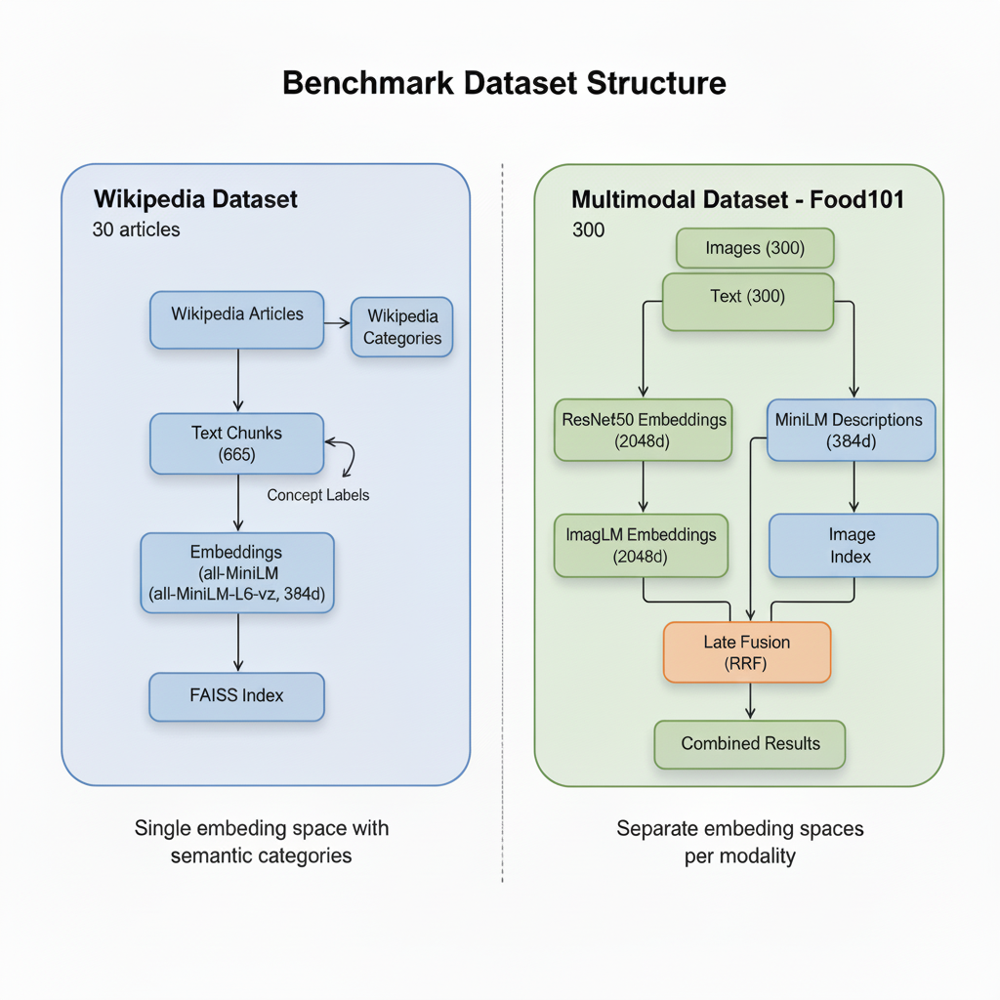
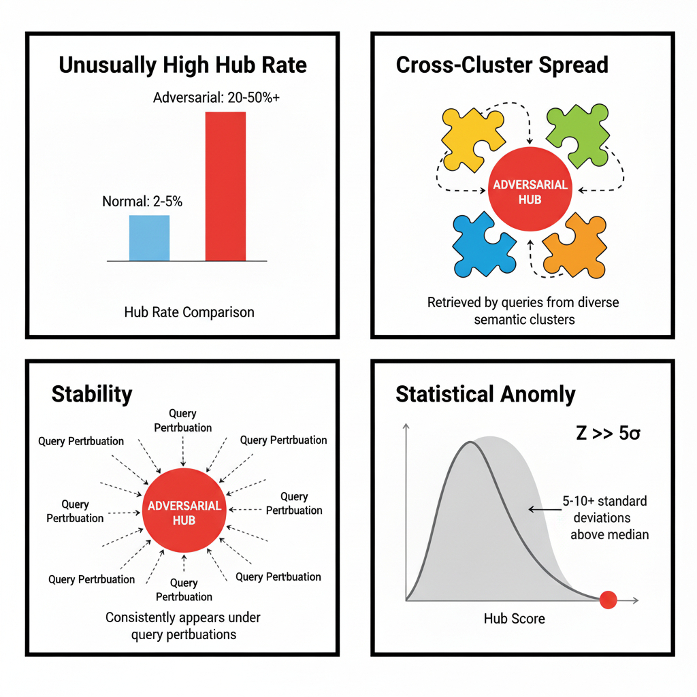
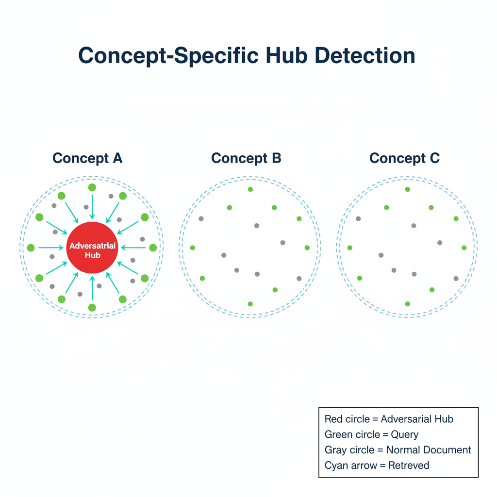
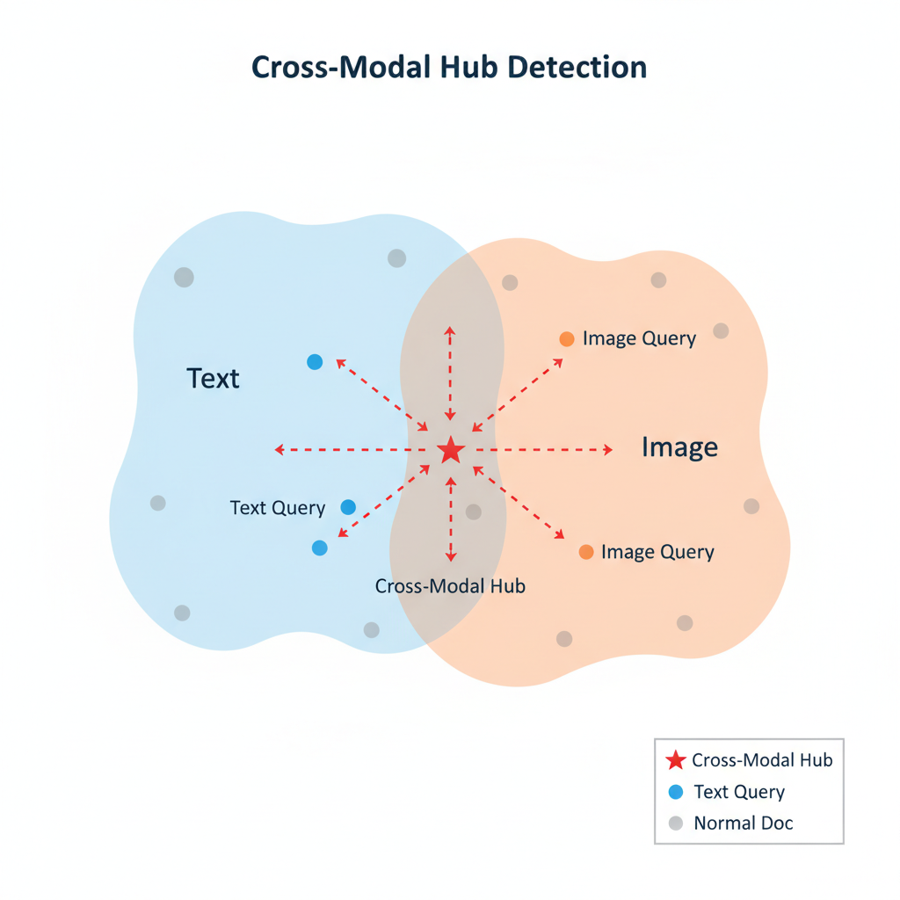

# HubScan Benchmarks

Benchmarking suite for evaluating HubScan's adversarial hub detection capabilities.



*Figure: Dataset structure comparison: Wikipedia (text-only) vs Multimodal (gold standard architecture)*

## Quick Start

### 1. Generate a Wikipedia Benchmark Dataset

```bash
cd scripts
python create_wikipedia_benchmark.py --size small --output ../data/wikipedia/
```

Creates a text-only dataset with:
- Wikipedia article chunks
- Real Wikipedia categories as concepts
- 384-dimensional embeddings (all-MiniLM-L6-v2)

### 2. Generate a Multimodal Benchmark Dataset

```bash
python create_multimodal_benchmark.py --output ../data/multimodal/ --max-samples 300
```

Creates a multimodal dataset with:
- Image and text documents using separate embedding spaces
- Separate indexes: `text_index.index` (384-dim), `image_index.index` (2048-dim)
- ResNet50 embeddings for images (2048-dim)
- Sentence-transformer embeddings for text (384-dim)
- Modality labels and concept clusters
- Gold standard architecture support (parallel retrieval + late fusion)
- Combined `embeddings.npy` for backward compatibility

### 3. Plant Adversarial Hubs

```bash
# For text-only datasets (Wikipedia)
python plant_hubs.py --dataset ../data/wikipedia/ --strategy all --rate 0.05

# For multimodal datasets (separate embedding spaces)
python plant_hubs.py --dataset ../data/multimodal/ --strategy effective --rate 0.02
```

Available strategies:
- `geometric` - Center-of-mass hubs
- `multi_centroid` - Multi-cluster targeting hubs
- `gradient` - Gradient-based adversarial hubs (text/shared space only)
- `lexical` - Keyword-targeting hubs (text/shared space only)
- `concept_specific` - Concept-localized hubs (text/shared space only)
- `cross_modal` - Cross-modality exploiting hubs
- `all` - All strategies combined
- `effective` - Effective strategies for multimodal (geometric + multi_centroid + cross_modal)

### 4. Run Benchmark

```bash
# Wikipedia benchmark (text-only)
python run_benchmark.py \
    --dataset ../data/wikipedia/ \
    --config ../configs/concept_modality.yaml \
    --output ../results/wikipedia/

# Multimodal benchmark
python run_benchmark.py \
    --dataset ../data/multimodal/ \
    --config ../configs/multimodal.yaml \
    --output ../results/multimodal/
```

## Using Datasets from the "adv_hub" Paper (arXiv:2412.14113)

The paper repo ([`Tingwei-Zhang/adv_hub`](https://github.com/Tingwei-Zhang/adv_hub)) uses standard retrieval benchmarks (e.g., MSCOCO).
That repo does not include precomputed embeddings, so to benchmark HubScan you must:

- download a dataset (e.g., COCO captions annotations)
- build `embeddings.npy` + `metadata.json` in HubScan's benchmark format
- optionally plant hubs and evaluate

### Example: MSCOCO captions (text-only)

1) Download COCO captions annotations (example path shown below):

- `captions_val2017.json` (from MSCOCO 2017)

2) Create a HubScan dataset folder:

```bash
python benchmarks/scripts/create_mscoco_captions_benchmark.py \
  --coco-captions /path/to/captions_val2017.json \
  --output benchmarks/data/mscoco_captions/ \
  --max-captions 50000
```

3) Plant hubs and run the benchmark:

```bash
python benchmarks/scripts/plant_hubs.py --dataset benchmarks/data/mscoco_captions/ --strategy all --rate 0.02
python benchmarks/scripts/run_benchmark.py --dataset benchmarks/data/mscoco_captions/ --config benchmarks/configs/concept_modality.yaml --output benchmarks/results/mscoco_captions/
```

4) Pretty-print results for an "Evaluation" section:

```bash
python benchmarks/scripts/pretty_print_benchmark_results.py \
  --results benchmarks/results/mscoco_captions/benchmark_results.json
```

## Usage Examples

### CLI Usage

#### Basic Text-Only Benchmark

```bash
python run_benchmark.py \
    --dataset ../data/wikipedia/ \
    --config ../configs/concept_modality.yaml \
    --output ../results/wikipedia/
```

**Flag Explanations:**
- `--dataset ../data/wikipedia/`: Points to the dataset directory containing `embeddings.npy`, `metadata.json`, and `ground_truth.json`. This directory structure is required for benchmark evaluation.
- `--config ../configs/concept_modality.yaml`: Configuration file for concept-aware detection. This config enables concept-aware detection by default.
- `--output ../results/wikipedia/`: Specifies where benchmark results (metrics, reports) will be saved. Separate output directories allow comparing multiple benchmark runs.

#### Multimodal Benchmark with Advanced Detection

```bash
python run_benchmark.py \
    --dataset ../data/multimodal/ \
    --config ../configs/multimodal.yaml \
    --output ../results/multimodal/ \
    --enable-concept-aware \
    --enable-modality-aware
```

**Flag Explanations:**
- `--dataset ../data/multimodal/`: Multimodal dataset with image and text documents.
- `--config ../configs/multimodal.yaml`: Configuration for multimodal datasets with concept and modality-aware detection.
- `--enable-concept-aware`: Enables concept-aware detection to catch hubs targeting specific semantic categories.
- `--enable-modality-aware`: Enables cross-modal hub detection.

#### Comparing Multiple Ranking Methods

```bash
python run_benchmark.py \
    --dataset ../data/wikipedia/ \
    --config ../configs/concept_modality.yaml \
    --output ../results/comparison/ \
    --ranking-methods vector hybrid lexical vector+rerank \
    --enable-concept-aware
```

**Flag Explanations:**
- `--ranking-methods vector hybrid lexical vector+rerank`: Tests four different ranking approaches:
  - `vector`: Pure vector similarity search
  - `hybrid`: Combines vector and lexical search
  - `lexical`: Pure keyword/BM25 search
  - `vector+rerank`: Vector search with reranking

### SDK Usage

#### Basic Benchmark Execution

```python
import sys
from pathlib import Path
sys.path.insert(0, str(Path(__file__).parent.parent))

from hubscan import Config, Scanner
from hubscan import get_suspicious_documents, Verdict

# Load configuration
config = Config.from_yaml("benchmarks/configs/concept_modality.yaml")
config.input.embeddings_path = "benchmarks/data/wikipedia/embeddings.npy"
config.input.metadata_path = "benchmarks/data/wikipedia/metadata.json"

# Enable concept-aware detection
config.detectors.concept_aware.enabled = True
config.detectors.concept_aware.mode = "metadata"
config.detectors.concept_aware.metadata_field = "concept"
config.detectors.concept_aware.concept_hub_z_threshold = 4.0

# Configuration:
# - mode="metadata": Uses existing concept labels from metadata
# - metadata_field="concept": Matches the field name in benchmark metadata
# - concept_hub_z_threshold=4.0: Threshold for concept-specific hub detection

# Run scan
scanner = Scanner(config)
scanner.load_data()
results = scanner.scan()

# Extract high-risk documents
high_risk = get_suspicious_documents(results, verdict=Verdict.HIGH)
print(f"Detected {len(high_risk)} HIGH risk documents")

# Compare with ground truth
import json
with open("benchmarks/data/wikipedia/ground_truth.json") as f:
    ground_truth = json.load(f)
    
hub_positions = set(ground_truth["hub_positions"])
detected_positions = {doc["doc_index"] for doc in high_risk}

true_positives = len(hub_positions & detected_positions)
precision = true_positives / len(detected_positions) if detected_positions else 0
recall = true_positives / len(hub_positions) if hub_positions else 0

print(f"Precision: {precision:.2%}")
print(f"Recall: {recall:.2%}")
```

#### Multimodal Benchmark

```python
from hubscan import Config, Scanner
from hubscan import get_suspicious_documents, Verdict

# Load multimodal configuration
config = Config.from_yaml("benchmarks/configs/multimodal.yaml")
config.input.embeddings_path = "benchmarks/data/multimodal/embeddings.npy"
config.input.metadata_path = "benchmarks/data/multimodal/metadata.json"

# Enable advanced detection
config.detectors.concept_aware.enabled = True
config.detectors.concept_aware.metadata_field = "concept"
config.detectors.modality_aware.enabled = True
config.detectors.modality_aware.doc_modality_field = "modality"
config.detectors.modality_aware.cross_modal_penalty = 1.5

# Modality-aware configuration:
# - cross_modal_penalty=1.5: Multiplier for cross-modal hits

# Run scan
scanner = Scanner(config)
scanner.load_data()
results = scanner.scan()

# Analyze results
high_risk = get_suspicious_documents(results, verdict=Verdict.HIGH)
medium_risk = get_suspicious_documents(results, verdict=Verdict.MEDIUM)

print(f"HIGH risk: {len(high_risk)}")
print(f"MEDIUM risk: {len(medium_risk)}")
print(f"Runtime: {results['runtime']:.2f}s")
```

#### Custom Benchmark with Multiple Ranking Methods

```python
from hubscan import Config, Scanner

# Base configuration
config = Config.from_yaml("benchmarks/configs/concept_modality.yaml")
config.input.embeddings_path = "benchmarks/data/wikipedia/embeddings.npy"
config.input.metadata_path = "benchmarks/data/wikipedia/metadata.json"

# Test different ranking methods
ranking_methods = ["vector", "hybrid", "lexical"]

results_by_method = {}

for method in ranking_methods:
    # Configure ranking method
    config.scan.ranking.method = method
    
    if method == "hybrid":
        config.scan.ranking.hybrid_alpha = 0.5
    
    if method == "lexical":
        config.scan.query_texts_path = "benchmarks/data/wikipedia/query_texts.json"
    
    # Run scan
    scanner = Scanner(config)
    scanner.load_data()
    results = scanner.scan()
    
    results_by_method[method] = results
    
    # Extract metrics
    high_risk = get_suspicious_documents(results, verdict=Verdict.HIGH)
    print(f"{method}: {len(high_risk)} HIGH risk documents detected")

# Compare results
print("\nComparison:")
for method, results in results_by_method.items():
    high_risk = get_suspicious_documents(results, verdict=Verdict.HIGH)
    print(f"{method:15s} HIGH: {len(high_risk):4d}  Runtime: {results['runtime']:.2f}s")
```

#### Benchmark with Reranking

```python
from hubscan import Config, Scanner

config = Config.from_yaml("benchmarks/configs/concept_modality.yaml")
config.input.embeddings_path = "benchmarks/data/wikipedia/embeddings.npy"
config.input.metadata_path = "benchmarks/data/wikipedia/metadata.json"

# Enable reranking
config.scan.ranking.rerank = True
config.scan.ranking.rerank_method = "default"
config.scan.ranking.rerank_top_n = 100  # Retrieve top 100, then rerank to top 20

# Reranking configuration:
# - rerank_top_n=100: Retrieve more candidates than final k (20) to give reranker options

config.detectors.concept_aware.enabled = True

scanner = Scanner(config)
scanner.load_data()
results = scanner.scan()

print(f"Detected {len(get_suspicious_documents(results, verdict=Verdict.HIGH))} HIGH risk documents")
```

## Benchmark Results



*Figure: Detection metrics and thresholds used in benchmarks*

### Wikipedia (Text-Only)

| Metric | HIGH | HIGH+MEDIUM |
|--------|------|-------------|
| Precision | 96% | 40% |
| Recall | 100% | 100% |
| F1 Score | 0.98 | 0.57 |
| False Positive Rate | <1% | 4% |

Per-Strategy Detection (HIGH recall):
- geometric_hub: 100%
- multi_centroid_hub: 100%
- concept_specific_hub: 100%
- gradient_based_hub: 100%
- cross_modal_hub: 100%

**Note:** HIGH recall means detection of high-risk documents only. HIGH+MEDIUM includes both high and medium-risk detections, providing a more comprehensive view but with lower precision.

### Multimodal (Separate Embedding Spaces)

| Metric | HIGH | HIGH+MEDIUM |
|--------|------|-------------|
| Precision | 100% | 100% |
| Recall | 100% | 100% |
| F1 Score | 1.00 | 1.00 |
| False Positive Rate | 0% | 0% |

Per-Strategy Detection (HIGH recall):
- geometric_hub: 100%
- multi_centroid_hub: 100%
- cross_modal_hub: 100%

**Note:** Multimodal benchmarks use the "effective" strategy set (geometric, multi_centroid, cross_modal) for separate embedding spaces. Strategies like gradient_based, lexical, and concept_specific are designed for shared embedding spaces.

## Embedding Architecture for Multimodal

This benchmark uses separate embedding models per modality:

**Models:**
- Images: ResNet50 (2048-dimensional)
- Text: Sentence-transformers (384-dimensional)

**Generated Files:**
- `embeddings.npy` - Combined padded embeddings for benchmark validation
- `text_embeddings.npy`, `image_embeddings.npy` - Separate embeddings
- `text_index.index`, `image_index.index` - Separate FAISS indexes for production use

**Strategy Selection:**
- Use `--strategy effective` for multimodal datasets with separate embedding spaces
- The "effective" strategies (geometric, multi_centroid, cross_modal) are compatible with separate embedding spaces
- Strategies like gradient_based, lexical, and concept_specific assume a shared embedding space

See [docs/CONCEPTS_AND_MODALITIES.md](../docs/CONCEPTS_AND_MODALITIES.md) for embedding guidance and production deployment information.

## Hub Planting Strategies

The benchmark includes multiple adversarial hub strategies to test detection capabilities:



*Figure: Concept-specific hub targeting a single semantic category*



*Figure: Cross-modal hub exploiting different embedding spaces*

### Strategy A: Geometric Hub (Effective for Multimodal)
Creates hubs as weighted averages of diverse documents. These hubs appear near the center of multiple semantic clusters, making them likely to be retrieved by diverse queries.

### Strategy B: Multi-Centroid Hub (Effective for Multimodal)
Creates hubs targeting multiple semantic clusters simultaneously. More sophisticated than geometric hubs, these maximize retrieval across distinct topic areas.

### Strategy C: Gradient-Based Hub (Text/Shared Space Only)
Uses optimization to create hubs that maximize retrieval probability. This strategy uses gradient descent to find embeddings that appear in top-k results for the maximum number of queries. Requires a shared embedding space.

### Strategy D: Lexical Hub (Text/Shared Space Only)
Targets keyword/BM25-based retrieval systems. These hubs are crafted to match common query terms and patterns, exploiting lexical search vulnerabilities. Requires a shared embedding space with text semantics.

### Strategy E: Concept-Specific Hub (Text/Shared Space Only)
Creates hubs that dominate within a specific semantic concept/cluster. These can evade global detection while manipulating results within a narrow topic area. Requires a shared embedding space where concepts transfer across modalities.

### Strategy F: Cross-Modal Hub (Effective for Multimodal)
Creates hubs that exploit cross-modal embedding spaces. In multimodal systems, these hubs appear relevant to queries in one modality (e.g., text) while being semantically unrelated.

## Configuration

### Concept-Aware Detection

```yaml
detectors:
  concept_aware:
    enabled: true
    mode: metadata
    metadata_field: concept
    num_concepts: 10
    concept_hub_z_threshold: 4.0
```

### Modality-Aware Detection

```yaml
detectors:
  modality_aware:
    enabled: true
    mode: metadata
    doc_modality_field: modality
    query_modality_field: modality
    cross_modal_penalty: 1.5
```


## Extending the Benchmark

### Adding a New Hub Strategy

Create a new strategy class in `scripts/hub_strategies.py`:

```python
class MyCustomStrategy(HubStrategy):
    def __init__(self):
        super().__init__(
            name="my_custom_hub",
            description="My custom adversarial hub strategy"
        )
    
    def create_hub(self, embeddings, num_hubs=1, **kwargs):
        # Your hub creation logic
        hub_embeddings = ...
        metadata = {"strategy": self.name}
        return hub_embeddings, metadata
```

### Adding a New Dataset Type

Create a generator script following the pattern of `create_wikipedia_benchmark.py` or `create_multimodal_benchmark.py`. Ensure output includes:

**Required files:**
- `embeddings.npy` - Document embeddings (or separate `text_embeddings.npy` and `image_embeddings.npy` for multimodal)
- `metadata.json` - Document metadata with concept and modality fields
- `query_texts.json` - Query texts for lexical/hybrid search
- `dataset_info.json` - Dataset metadata

**For gold standard architecture (multimodal):**
- `text_index.index` - Separate FAISS index for text embeddings
- `image_index.index` - Separate FAISS index for image embeddings
- `unified_index.index` - Optional unified/cross-modal index (recall backstop)

**Metadata format:**
```json
{
  "doc_id": "doc_001",
  "concept": "category_name",
  "modality": "text",
  "text": "Document content",
  "is_adversarial": false
}
```

## Requirements

```
numpy
sentence-transformers
scikit-learn
datasets
torch
torchvision
pillow
```
